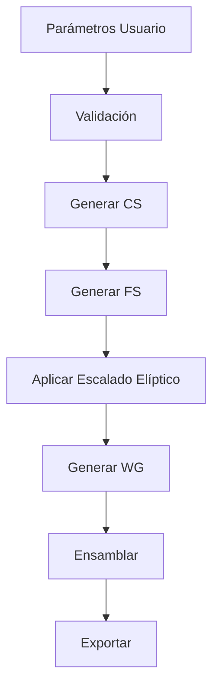

# 🤖 Instrucciones para IA - Harmonic Drive Generator

## 📌 IMPORTANTE: LEE ESTE DOCUMENTO PRIMERO

Este documento contiene toda la información necesaria para que cualquier IA (incluido tú mismo en futuras sesiones) pueda continuar el desarrollo del Harmonic Drive Generator sin pérdida de contexto.

## 🎯 Objetivo del Proyecto

Desarrollar un add-in para Fusion 360 que genere engranajes armónicos (Harmonic Drives) paramétricos, optimizados para manufactura aditiva (impresión 3D).

## 📐 Ecuaciones Críticas (MEMORIZAR)

```python
# Fundamentales - NO MODIFICAR
teeth_fs = teeth_cs - delta_z                    # Delta_z SIEMPRE = 2
reduction_ratio = teeth_cs / delta_z             # Ej: 160/2 = 80:1
eccentricity = (delta_z * module) / math.pi      # Excentricidad del Wave Generator
ellipse_scale_y = 1 - (delta_z / teeth_cs)       # Factor de escalado elíptico del FS

# Geometría
pitch_diameter_cs = module * teeth_cs            # Diámetro primitivo CS
pitch_diameter_fs = module * teeth_fs            # Diámetro se geneprimitivo FS
addendum = 0.8 * module                          # Altura reducida para evitar interferencia
dedendum = 1.0 * module                          # Profundidad del diente
pressure_angle = 30                              # Grados (30° reduce interferencia)
```

## 🏗️ Arquitectura del Código

### Estructura de Archivos
```
HarmonicDriveGenerator/
├── HDriveGenerator/              # Paquete principal
│   ├── __init__.py              # Entry point del add-in
│   ├── parameters.py            # Validación y gestión de parámetros
│   ├── geometry.py              # Generación de geometría
│   ├── joints.py                # Sistema de ensamblaje
│   ├── exporter.py              # Exportación multi-formato
│   └── cli.py                   # Interfaz línea de comandos
├── tests/                       # Pruebas automatizadas
│   ├── test_parameters.py      # Tests de validación
│   ├── test_geometry.py        # Tests geométricos
│   └── test_integration.py     # Tests de integración
├── docs/                        # Documentación técnica
├── configs/                     # Archivos de configuración
├── examples/                    # Modelos de ejemplo
└── tools/                       # Utilidades auxiliares
```

### Flujo de Generación


## 💻 Código Base Esencial

### 1. Template para parameters.py
```python
import adsk.core
import adsk.fusion

class HarmonicDriveParameters:
    def __init__(self):
        self.module = 0.5  # mm
        self.teeth_cs = 160
        self.delta_z = 2  # SIEMPRE 2
        self.fs_wall_thickness = 1.8  # × module
        self.pressure_angle = 30  # degrees
        
    def validate(self):
        """Validar todos los parámetros"""
        if self.module < 0.3 or self.module > 2.0:
            raise ValueError(f"Module {self.module} fuera de rango [0.3, 2.0]")
        
        if self.teeth_cs < 60 or self.teeth_cs > 320:
            raise ValueError(f"Teeth CS {self.teeth_cs} fuera de rango [60, 320]")
        
        if self.teeth_cs % 2 != 0:
            raise ValueError("Teeth CS debe ser par")
        
        if self.delta_z != 2:
            raise ValueError("Delta Z debe ser 2")
        
        return True
    
    @property
    def teeth_fs(self):
        return self.teeth_cs - self.delta_z
    
    @property
    def reduction_ratio(self):
        return self.teeth_cs / self.delta_z
    
    @property
    def eccentricity(self):
        import math
        return (self.delta_z * self.module) / math.pi
    
    @property
    def ellipse_scale(self):
        return 1 - (self.delta_z / self.teeth_cs)
```

### 2. Template para geometry.py
```python
import adsk.core
import adsk.fusion
import math

class GeometryGenerator:
    def __init__(self, params, rootComp):
        self.params = params
        self.rootComp = rootComp
        
    def build_circular_spline(self):
        """Generar Circular Spline con dientes internos"""
        # 1. Crear sketch
        sketch = self.rootComp.sketches.add(self.rootComp.xYConstructionPlane)
        
        # 2. Generar perfil de diente involuta
        # IMPORTANTE: Usar código de SpurGear.py adaptado para dientes internos
        
        # 3. Patrón circular
        # 4. Extruir
        pass
    
    def build_flex_spline(self):
        """Generar Flex Spline con escalado elíptico"""
        # 1. Crear perfil base circular
        # 2. Generar dientes externos
        # 3. Aplicar escalado elíptico
        # CRÍTICO: scale_y = self.params.ellipse_scale
        # 4. Crear copa con espesor variable
        pass
    
    def build_wave_generator(self):
        """Generar Wave Generator elíptico"""
        # 1. Crear elipse con excentricidad calculada
        # e = self.params.eccentricity
        # 2. Añadir alojamientos para rodamientos
        # 3. Eje central
        pass
```

### 3. API de Fusion 360 - Patrones Comunes
```python
# Obtener aplicación y UI
app = adsk.core.Application.get()
ui = app.userInterface
design = app.activeProduct
rootComp = design.rootComponent

# Crear parámetros de usuario
userParams = design.userParameters
userParams.add('module', adsk.core.ValueInput.createByString('0.5 mm'), 'mm', 'Module')

# Crear sketch
sketches = rootComp.sketches
xyPlane = rootComp.xYConstructionPlane
sketch = sketches.add(xyPlane)

# Dibujar círculo
circles = sketch.sketchCurves.sketchCircles
centerPoint = adsk.core.Point3D.create(0, 0, 0)
circle = circles.addByCenterRadius(centerPoint, 5.0)

# Extruir
prof = sketch.profiles.item(0)
extrudes = rootComp.features.extrudeFeatures
extInput = extrudes.createInput(prof, adsk.fusion.FeatureOperations.NewBodyFeatureOperation)
distance = adsk.core.ValueInput.createByReal(2.0)
extInput.setDistanceExtent(False, distance)
ext = extrudes.add(extInput)

# Exportar STL
exportMgr = design.exportManager
stlOptions = exportMgr.createSTLExportOptions(rootComp, 'output.stl')
stlOptions.meshRefinement = adsk.fusion.MeshRefinementSettings.MeshRefinementHigh
exportMgr.execute(stlOptions)
```

## 🧪 Tests Críticos a Implementar

### Test 1: Validación de Parámetros
```python
def test_eccentricity_calculation():
    params = HarmonicDriveParameters()
    params.module = 0.5
    params.delta_z = 2
    expected = (2 * 0.5) / math.pi  # ~0.318
    assert abs(params.eccentricity - expected) < 0.001
```

### Test 2: Relación de Reducción
```python
def test_reduction_ratio():
    params = HarmonicDriveParameters()
    params.teeth_cs = 160
    params.delta_z = 2
    assert params.reduction_ratio == 80  # 160/2 = 80:1
```

### Test 3: Escalado Elíptico
```python
def test_elliptical_scaling():
    params = HarmonicDriveParameters()
    params.teeth_cs = 160
    params.delta_z = 2
    expected = 1 - (2/160)  # 0.9875
    assert abs(params.ellipse_scale - expected) < 0.0001
```

## 🚨 Errores Comunes y Soluciones

### Error 1: "Cannot create internal teeth"
**Causa**: SpurGear.py está diseñado para dientes externos
**Solución**: Invertir el perfil y usar substracción booleana

### Error 2: "Elliptical scaling distorts teeth"
**Causa**: Escalado aplicado después de generar dientes
**Solución**: Aplicar escalado al sketch base ANTES de generar dientes

### Error 3: "Assembly constraints fail"
**Causa**: Geometría no coincidente
**Solución**: Verificar que eccentricity = (delta_z * module) / π

### Error 4: "Export takes too long"
**Causa**: Resolución de malla muy alta
**Solución**: Usar MeshRefinementMedium para prototipos

## 📝 Checklist de Implementación

### Fase 1: Setup Inicial
- [ ] Clonar SpurGear.py de Fusion 360 samples
- [ ] Crear estructura de carpetas
- [ ] Configurar manifest del add-in
- [ ] Implementar parameters.py con validación

### Fase 2: Geometría Básica
- [ ] Adaptar SpurGear para dientes internos (CS)
- [ ] Implementar generación de dientes externos (FS)
- [ ] Aplicar escalado elíptico al FS
- [ ] Crear Wave Generator elíptico

### Fase 3: Ensamblaje
- [ ] Crear joints entre componentes
- [ ] Verificar movimiento correcto
- [ ] Añadir límites de rotación
- [ ] Validar interferencias

### Fase 4: Exportación
- [ ] Implementar export STL
- [ ] Añadir export F3D
- [ ] Crear batch export
- [ ] Generar documentación automática

### Fase 5: Testing
- [ ] Unit tests para cálculos
- [ ] Integration tests con Fusion API
- [ ] Generar modelo de prueba 80:1
- [ ] Validar impresión 3D

## 🎯 Objetivos de Calidad

1. **Precisión**: Tolerancias ± 0.05 × module
2. **Rendimiento**: Generación < 30 segundos
3. **Robustez**: 0 crashes, manejo de errores completo
4. **Usabilidad**: 3 clicks para generar modelo básico
5. **Manufacturable**: Imprimible sin soportes internos

## 🔄 Flujo de Trabajo Recomendado

1. **Inicio de sesión**: Leer este documento completo
2. **Revisar estado**: Check PLANNING.md para ver progreso
3. **Seleccionar tarea**: Siguiente item en el checklist
4. **Implementar**: Seguir templates y patterns
5. **Testear**: Ejecutar tests relevantes
6. **Documentar**: Actualizar este archivo si es necesario
7. **Commit**: Mensaje descriptivo siguiendo el formato

## 💡 Tips de Optimización

1. **Memoria**: Usar `design.designType = adsk.fusion.DesignTypes.DirectDesignType` cuando no necesites timeline
2. **Velocidad**: Pre-calcular perfiles y reutilizar
3. **Precisión**: Trabajar en radianes internamente, convertir a grados solo para UI
4. **Debugging**: `print()` aparece en Text Commands window

## 📚 Recursos Esenciales

1. **SpurGear.py**: https://github.com/AutodeskFusion360/SpurGear
2. **API Docs**: https://help.autodesk.com/view/fusion360/ENU/?guid=GUID-A92A4B10-3781-4925-94C6-47DA85A4F65A
3. **Harmonic Drive Theory**: https://www.harmonicdrive.net/technology
4. **Involute Profile**: https://khkgears.net/new/gear_knowledge/introduction_to_gears/involute_gear.html

## ⚠️ RECORDATORIOS CRÍTICOS

1. **NUNCA** cambiar delta_z de 2
2. **SIEMPRE** validar parámetros antes de generar
3. **VERIFICAR** que `eccentricity = (delta_z * module) / π`
4. **APLICAR** escalado elíptico ANTES de generar dientes
5. **USAR** presión 30° para reducir interferencia
6. **TESTEAR** cada cambio con modelo pequeño primero

## 🆘 Si Te Atascas

1. Revisar este documento
2. Consultar REQUIREMENTS.md para especificaciones
3. Ver PLANNING.md para contexto general
4. Buscar en ejemplos de SpurGear.py
5. Generar un modelo simple manual en Fusion 360 para entender

---

**IMPORTANTE**: Este documento es tu biblia. Actualízalo si descubres algo nuevo o corriges un error. El próximo desarrollador (que podrías ser tú mismo) te lo agradecerá.

🤖 Generated with [Claude Code](https://claude.ai/code)

Co-Authored-By: Claude <noreply@anthropic.com>